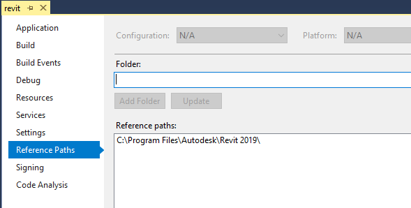

# Update Family in RVT models - Design Automation for Revit


[](http://developer.autodesk.com/)


# Description

This sample load and update instances of a family on a model.

# Setup

## Prerequisites

1. **Visual Studio** 2017
2. **Revit** 2019 required to compile changes into the plugin
3. **7z zip** requires to create the bundle ZIP, [download here](https://www.7-zip.org/)

## References

This Revit plugin requires **RevitAPI** and **DesignAutomationBridge** references. The `Reference Paht` option should point to the folder.



## Build

Under **Properties**, at **Build Event** page, the following `Post-build event command line` will copy the DLL into the `\UpdateFamily.bundle/Content/` folder, create a `.ZIP` (using [7z](https://www.7-zip.org/)) and copy to the Webapp folder.

```
xcopy /Y /F "$(TargetDir)*.dll" "$(ProjectDir)UpdateFamily.bundle\Contents\"
del /F "$(ProjectDir)..\web\wwwroot\bundles\UpdateFamily.zip"
"C:\Program Files\7-Zip\7z.exe" a -tzip "$(ProjectDir)../web/wwwroot/bundles/UpdateFamily.zip" "$(ProjectDir)UpdateFamily.bundle\" -xr0!*.pdb
```

# Further Reading

- [My First Revit Plugin](https://knowledge.autodesk.com/support/revit-products/learn-explore/caas/simplecontent/content/my-first-revit-plug-overview.html)
- [Revit Developer Center](https://www.autodesk.com/developer-network/platform-technologies/revit)

## License

This sample is licensed under the terms of the [MIT License](http://opensource.org/licenses/MIT). Please see the [LICENSE](LICENSE) file for full details.

## Written by

Naveen Kumar, Forge Partner Development team.